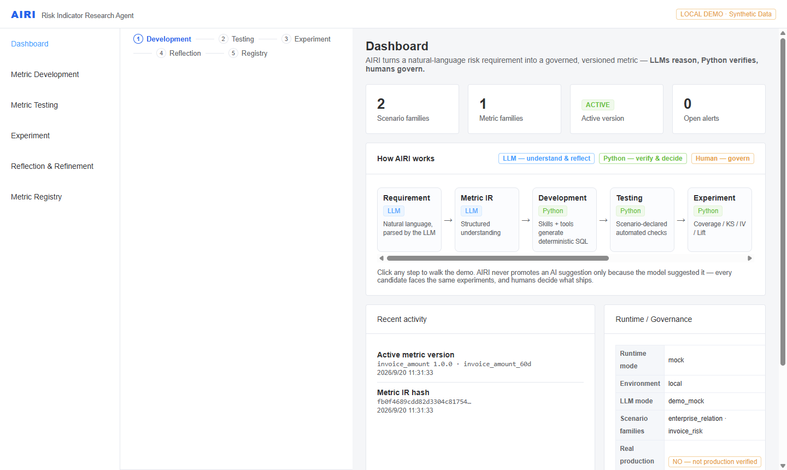
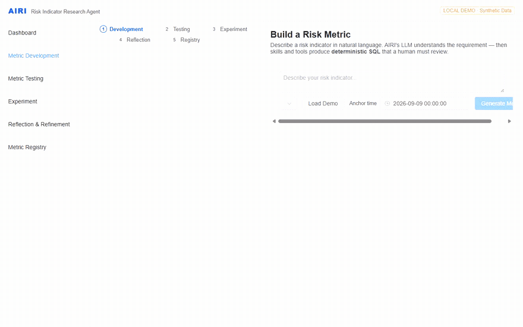
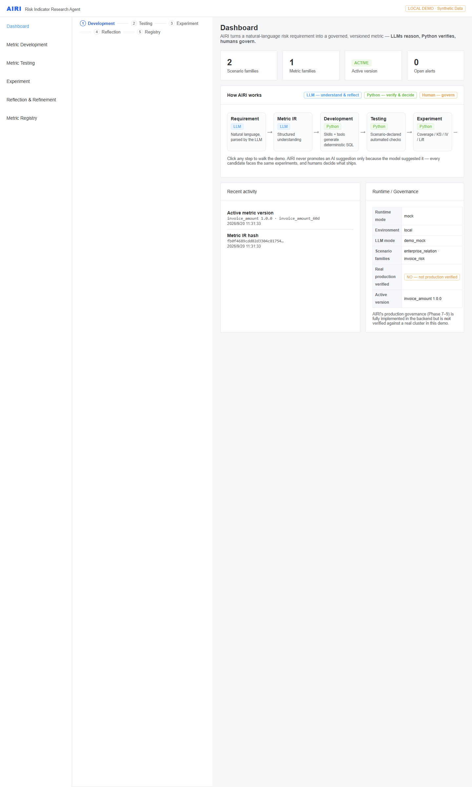
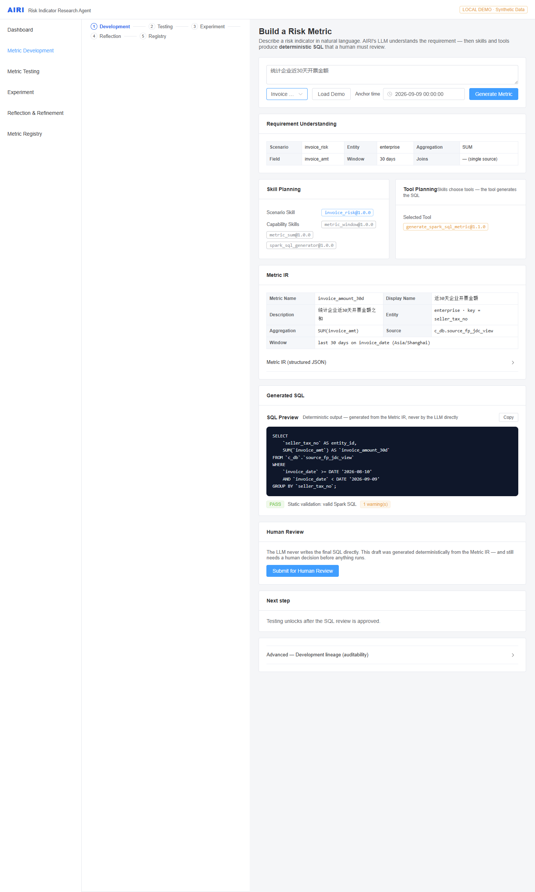
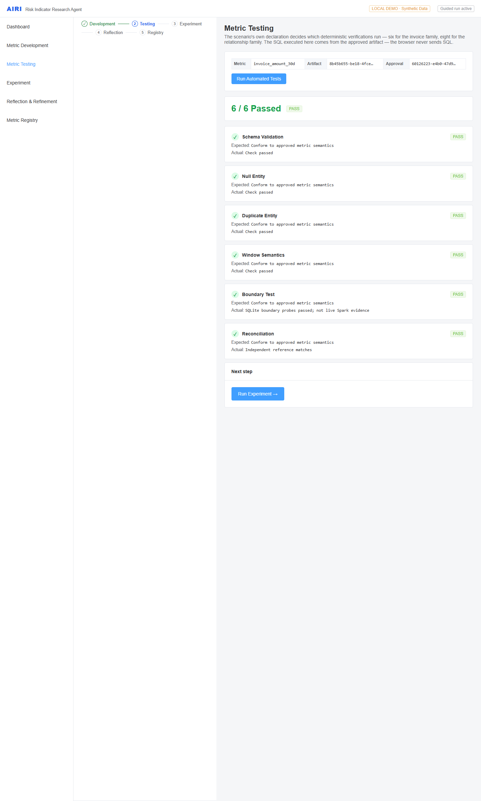
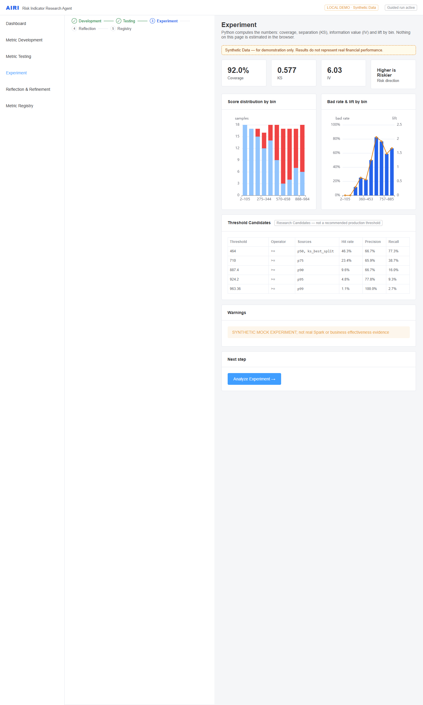
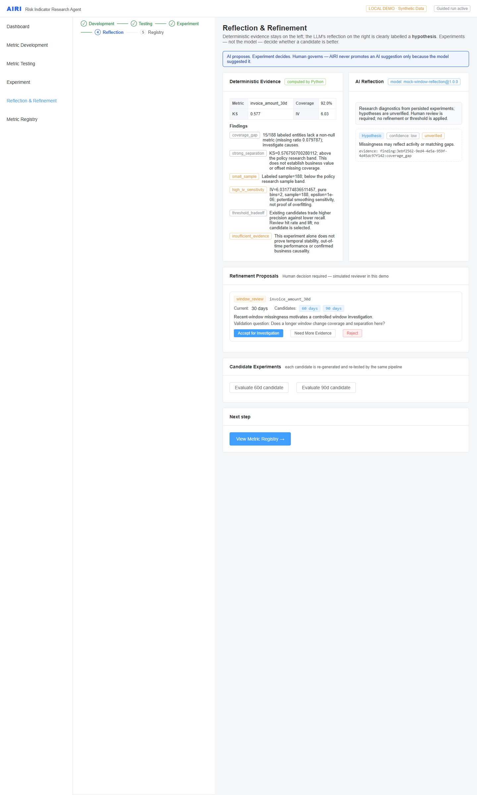
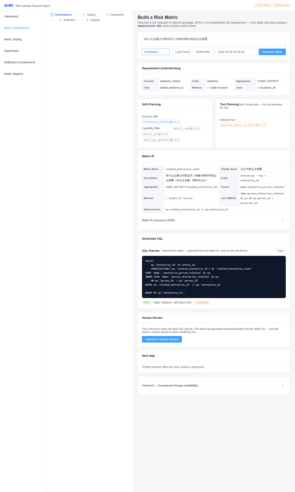
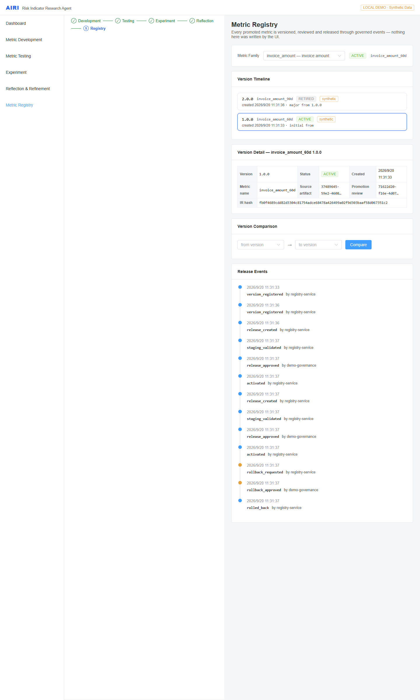

# AIRI

**An AI-assisted risk metric research & development platform**

AIRI turns a natural-language risk requirement into structured **Metric IR**,
deterministic SQL, automated tests, metric experiments, evidence-driven
reflection, and governed metric versions.

> **LLMs reason. Python verifies. Humans govern.**

[](https://github.com/OWNER/REPO/actions/workflows/ci.yml)


<!-- The CI badge uses a placeholder URL. Replace OWNER/REPO after pushing, or
     delete that line. See "Repository status" near the end of this file. -->



> AIRI 是一个 AI 驱动的风控指标研发平台，将自然语言指标需求转换为可验证、可实验、可审计的指标工程流程。

---

## What is AIRI?

AIRI is an agentic pipeline for **metric engineering**. You describe a risk
indicator in natural language; AIRI resolves it into a structured
representation, generates the SQL with deterministic Python tools, tests it,
runs a statistical experiment, reflects on the evidence, and hands the result to
a human for approval at every gate that matters.

It is built around one architectural bet: **a language model should be trusted
to understand intent, and never to produce the artefact that gets deployed.**

The demo runs entirely locally on synthetic data — no Spark, no MySQL, no LLM
API key, no internal network.



*Invoice Risk flow, recorded from the real local demo server (48s). Also
available as [MP4](docs/demo/airi-demo.mp4).*

---

## Why AIRI?

**The problem.** LLMs can generate SQL, but raw generated SQL is hard to trust,
hard to test, and hard to govern. It cannot be reviewed against a spec, it
changes silently when the model or prompt changes, and it offers no clean point
at which a human can say *"this is the query I approve."*

**The approach.** Put a strict, reviewable representation between the model and
the database:

```text
Natural Language
   → Metric IR                 (structured, schema-validated)
   → Deterministic Python tool (template + allow-list)
   → SQL artifact              (content-addressed, approved by hash)
   → Automated testing
   → Experiment                (coverage / KS / IV / lift)
   → Reflection                (hypotheses only)
   → Governance                (human approval at each gate)
```

The model's output must survive a strict Pydantic schema. If it does not, the
run fails loudly — AIRI never silently repairs a bad model response, and never
quietly falls back to a canned answer.

---

## Key Features

- **Natural-language metric requirements** — parsed into a structured intent
- **Structured Metric IR** — a strict, versioned Pydantic contract
- **Scenario Skill × Capability Skill** — domain knowledge separated from execution mechanics
- **Deterministic SQL generation** — controlled Jinja templates, no model-authored SQL
- **Static SQL validation** — allow-list grammar (`INNER`/`LEFT` join only; no UNION, CTE injection, UDF, DDL/DML)
- **Automated metric testing** — schema, null, duplicate, window boundary, join correctness, distinct semantics, self-exclusion, reconciliation
- **Experimentation** — coverage, bad rate, decile bins, KS with direction, IV, lift, threshold candidates
- **Evidence-driven LLM reflection** — hypotheses stored separately from computed facts
- **Controlled refinement** — bounded, human-decided proposals
- **Temporal / OOT validation** — PSI against a frozen reference distribution, deterministic Python (0 LLM calls)
- **Metric Registry** — immutable, versioned, auditable, rollback-capable
- **Human-in-the-loop governance** — SQL approval, promotion review, release review, deployment review
- **Vue 3 Web UI** — dashboard, development, testing, experiment, reflection, registry
- **Two demo scenarios** through one identical workflow

---

## How It Works



Every stage writes an artefact, and each artefact is evidence for the next. The
UI labels which layer owns each step:

| Layer | Owns |
| --- | --- |
| **LLM** | Requirement understanding, reflection (hypotheses) |
| **Python** | IR validation, SQL generation, testing, statistics, hashing |
| **Human** | Approval, promotion, release, deployment |

See [Architecture Overview](docs/architecture/overview.md) for the full pipeline
and role separation.

---

## Architecture

```text
Scenario Skill  (business semantics)     Capability Skill  (mechanism)
   invoice_risk        ──┬──►  metric_sum, metric_window ──► spark_sql_generator
   enterprise_relation ──┴──►  metric_join, metric_count  ──► spark_sql_generator
                                        │
                                        ▼
                    Metric IR  →  Tool  →  SQL  →  Validation
                                        │
                                        ▼
                    Testing → Experiment → Reflection → Governance
```

> AIRI separates **domain knowledge** from **execution mechanics** through
> Scenario Skills × Capability Skills.

A scenario declares *what the business means*. A capability declares *how a
mechanism is realised* and pins the tool that implements it. `metric_join` knows
how to compose two structured sources through constrained equality joins — and
nothing about enterprises, persons, or risk. The
`enterprise → person → enterprise` path lives in the scenario skill. Nothing
resolves "latest"; every reference is a pinned `name@version`.

- [Architecture Overview](docs/architecture/overview.md) — pipeline, role separation, Metric IR
- [Design Principles](docs/architecture/design-principles.md) — the five boundaries and why they exist
- [Adding a Scenario](docs/guides/adding-scenario.md) — how the second scenario was added

---

## Design Principles

1. **The LLM never owns the final SQL.** `LLM → Metric IR → Tool → SQL`.
2. **Facts versus hypotheses.** Statistics are deterministic and recomputable; reflection is probabilistic and advisory.
3. **Scenario knowledge ≠ execution mechanics.** Business meaning stays out of the SQL layer.
4. **Research ≠ production.** An experiment passing is not a production release.
5. **Humans govern.** Approval, promotion, release, and deployment are separate decisions.

Each is argued in full in [Design Principles](docs/architecture/design-principles.md).

---

## Demo Scenarios

Two structurally different scenarios run through the **same** product workflow.
That is the point: a new domain costs scenario knowledge, not a new pipeline.

| Scenario | Requirement | Data shape | Capabilities |
| --- | --- | --- | --- |
| **Invoice Risk** | 统计企业近30天开票金额 | single fact table + time window | `metric_sum`, `metric_window` |
| **Enterprise Relation** | 统计企业关联自然人控制的其他企业数量 | `enterprise → person → enterprise` (two hops) | `metric_join`, `metric_count` |

Both share the requirement parser, Metric IR, skill planner, tool planner, SQL
generator, static validator, approval flow, testing, experiment engine, and Web
UI.

### Generated SQL — Invoice Risk

```sql
SELECT
    `seller_tax_no` AS entity_id,
    SUM(`invoice_amt`) AS `invoice_amount_30d`
FROM `c_db`.`source_fp_jdc_view`
WHERE
    `invoice_date` >= DATE '2026-08-10'
    AND `invoice_date` < DATE '2026-09-09'
GROUP BY `seller_tax_no`;
```

### Generated SQL — Enterprise Relation

```sql
SELECT
    ep.enterprise_id AS entity_id,
    COUNT(DISTINCT pe.related_enterprise_id) AS related_enterprise_count
FROM demo.enterprise_person_relation ep
INNER JOIN demo.person_enterprise_relation pe
    ON ep.person_id = pe.person_id
WHERE
    pe.related_enterprise_id <> ep.enterprise_id
GROUP BY
    ep.enterprise_id;
```

Both are produced by the shared deterministic tool from the Metric IR. The
workflow never builds SQL strings.

Full walkthrough: [Demo Guide](docs/guides/demo.md).

---

## Screenshots

| | |
| --- | --- |
|  |  |
| **Development** — requirement → IR → skills → SQL | **Testing** — scenario-declared checks |
|  |  |
| **Experiment** — coverage / KS / IV / lift | **Reflection** — diagnostics + proposals |
|  |  |
| **Enterprise Relation** — Join IR + two-hop SQL | **Registry** — governed metric versions |

All screenshots are captured from the running demo and keep the `LOCAL DEMO` /
`Synthetic Data` / `NOT PRODUCTION VERIFIED` markers visible on purpose. More in
[`docs/screenshots/`](docs/screenshots/).

---

## Quick Start

**Requirements:** Python ≥ 3.12, [uv](https://docs.astral.sh/uv/), Node.js ≥ 20.19, npm.

### Windows (verified)

```powershell
git clone <your-repo-url>
cd airi

.\scripts\start-demo.ps1     # migrate → seed synthetic data → start both servers
```

Then open <http://localhost:5173>. API docs at <http://localhost:8000/docs>.

Stop with:

```powershell
.\scripts\stop-demo.ps1
```

### macOS / Linux (best-effort)

```bash
./scripts/start-demo.sh
./scripts/stop-demo.sh
```

The shell scripts mirror the PowerShell flow, but the verified environment for
this project is Windows. Treat the `.sh` variants as best-effort.

### Docker

```bash
docker compose up --build
```

> Docker was **not available** in the development environment. The configuration
> is provided and statically reviewed, but its runtime behaviour is
> **NOT VERIFIED**.

Full options, manual setup, and troubleshooting:
[Quickstart Guide](docs/guides/quickstart.md).

### Terminal demo

```bash
uv run --frozen python examples/quick_demo.py
```

Drives one requirement through the whole chain — requirement, scenario, Metric
IR, skills, tool, SQL, approval, testing, experiment, reflection — in a few
seconds, then contrasts it with the second scenario.

---

## Configuration

Everything is an environment variable with the `AIRI_` prefix. Copy
[`.env.example`](.env.example) to `.env` if you want to override anything; the
demo works with the defaults, and `start-demo` sets what it needs explicitly so
the demo stays reproducible even if your `.env` points elsewhere.

| Variable | Demo default | Meaning |
| --- | --- | --- |
| `AIRI_DATABASE_URL` | `sqlite+pysqlite:///.demo/airi_web_demo.db` | local demo database |
| `AIRI_LLM_MODE` | `demo_mock` | deterministic LLM substitute, no network |
| `AIRI_EXECUTION_MODE` | `mock` | mock execution over synthetic fixtures |
| `AIRI_DEMO_FIXTURES` | `true` | load bundled synthetic datasets |
| `AIRI_CORS_ORIGINS` | `["http://localhost:5173"]` | allowed dev-server origin |
| `VITE_API_BASE_URL` | `http://localhost:8000` | backend URL for the Web UI |

`AIRI_LLM_MODE=demo_mock` is a **deliberate, explicitly configured substitute** —
not a fallback. Point it at a real OpenAI-compatible endpoint and an invalid or
schema-violating response raises an error; AIRI will not quietly degrade to the
mock.

---

## Project Structure

```text
airi/
├── src/airi/
│   ├── agents/           requirement parser (+ prompts)
│   ├── api/              FastAPI routers (14 modules)
│   ├── approvals/        content-addressed approval + canonical hashing
│   ├── core/             settings, schemas, exceptions
│   ├── environments/     Spark test environment acceptance
│   ├── evaluation/       coverage / KS / IV / lift calculator
│   ├── execution/        read-only execution + sandbox guard
│   ├── experiments/      experiment specs, runs, fixtures
│   ├── infrastructure/   database, LLM clients, query executors, fixtures
│   ├── metric_ir/        Metric IR models, joins, semantics, validation
│   ├── observability/    structured logging
│   ├── production/       adapters, identity, verification, reconciliation
│   ├── refinement/       bounded candidate refinement
│   ├── reflection/       reflection policy, models, workflow
│   ├── registry/         metric versions and audit events
│   ├── skills/           scenario + capability skills  ← domain knowledge
│   ├── temporal/         PSI, OOT slice validation
│   ├── testing/          test rules, probes, reports
│   ├── tools/            deterministic SQL generators  ← mechanism
│   └── workflows/        development / testing / experiment / reflection / ...
├── airi-web/             Vue 3 + TypeScript + Vite + Element Plus + ECharts
├── examples/             demo_phase*.py + quick_demo.py
├── scripts/              start/stop demo, seed, safety scan
├── docs/
│   ├── architecture/     overview, design principles
│   ├── guides/           quickstart, demo, adding-scenario, api, release checklist
│   ├── screenshots/      captured from the running demo
│   ├── demo/             demo GIF / MP4
│   ├── history/          phase-by-phase implementation reports
│   ├── interview/        pitch, Q&A, architecture walkthrough, demo script
│   └── portfolio.md      design rationale, interview form
├── tests/                backend test suite
├── migrations/           alembic (head: 0011_operational_convergence)
└── pyproject.toml
```

---

## API

FastAPI serves interactive reference docs at
<http://localhost:8000/docs> (and `/redoc`, `/openapi.json`). 116 routes total.

The domain endpoints that carry meaning:

| Domain | Endpoints |
| --- | --- |
| **Development** | `POST /api/v1/development/generate`, `GET /api/v1/development/artifacts/{id}` |
| **Approvals** | `POST /api/v1/approvals`, `POST …/approve`, `POST …/reject` |
| **Testing** | `POST /api/v1/tests/run`, `GET /api/v1/tests/{id}` |
| **Experiments** | `POST /api/v1/datasets`, `/labels`, `/experiments`, `POST …/run` |
| **Reflection** | `POST /api/v1/reflections`, `GET …/proposals`, `POST …/decision` |
| **Registry** | `POST /api/v1/metric-versions`, `GET …/active`, `/versions`, `/events`, `POST …/rollback` |
| **Runtime facts** | `GET /health`, `GET /api/v1/meta` |

Errors carry a machine-readable `error_code` (for example
`requirement_parse_failed`, `artifact_hash_mismatch`); governance conflicts
return `409`, and the UI renders the backend's code rather than inventing one.

Detailed guide: [API Guide](docs/guides/api.md).

---

## Testing

```bash
# backend
uv sync --frozen --extra dev
uv run --frozen pytest
uv run --frozen ruff check src tests scripts examples
uv run --frozen ruff format --check src tests scripts examples

# migrations (offline, SQLite)
AIRI_DATABASE_URL="sqlite+pysqlite:///.demo/check.db" uv run --frozen alembic upgrade head
AIRI_DATABASE_URL="sqlite+pysqlite:///.demo/check.db" uv run --frozen alembic check

# frontend
cd airi-web && npm ci && npm run build && npm run test
```

Current baseline: **675 backend tests passed / 14 skipped**, **28 frontend tests
passed**, `ruff` clean, alembic head `0011_operational_convergence` with no
model/migration drift.

The skipped tests are the integration suites that need real infrastructure
(Spark/Hive, MySQL, production identity, telemetry). CI runs everything else
offline. See [Release Checklist](docs/guides/release-checklist.md).

---

## Roadmap

AIRI v1.0 is feature-complete by design. Future work:

- [ ] **Bounded autonomous research** — let the AI generate and test hypotheses autonomously inside a sandbox; production-impacting decisions stay governed
- [ ] **Experiment budgeting** — caps on research spend per metric
- [ ] **Additional scenario packs** — more domains, same pipeline
- [ ] **Optional Spark/Hive runtime** — operator-verified integration
- [ ] **Enterprise IAM integrations**

---

## Limitations

Stated plainly, because they matter:

- **Synthetic data only.** Every bundled dataset is generated in-repo. It
  demonstrates the pipeline; it is **not** risk evidence, and the reported
  statistics say nothing about real predictive power.
- **Not production verified.** The Spark/Hive and production adapters exist in
  code and are exercised at the boundary layer, but they are **not verified**
  against a real environment in this repository. Turning that into a verified
  state is a human, operator-driven procedure — see
  [Real Environment Checklist](docs/guides/real-environment-checklist.md).
- **Default mode is offline.** SQLite, mock execution, deterministic LLM
  substitute. No API key, no cluster, no internal network.
- **Reflection is optional** and is not wired into automatic refinement.
- **One identifier is intentionally opaque.** The invoice fixture references a
  table name in an internal-looking schema (`c_db.source_fp_jdc_view`). It is a
  synthetic placeholder with no real data behind it, kept to avoid invalidating
  175 historical artefacts; the relation scenario uses neutral `demo.*` names.
- **Value naming is research-oriented.** Threshold candidates are research
  candidates, not recommended production thresholds.

---

## Security & Data

- All bundled demo data is synthetic — no real company, person, invoice, or
  identifier.
- The repository contains **no** credentials, tokens, internal hosts, or private
  keys. A guardrail script enforces this and runs in CI:

  ```bash
  uv run --frozen python scripts/check_open_source_safety.py
  ```

- Generated SQL passes a static validator (allow-list grammar) before it can be
  approved, and the execution sandbox is read-only.
- Identity providers and production adapters **default to inert** and fail
  closed.

Please read [SECURITY.md](SECURITY.md) before reporting a vulnerability.

---

## Repository status

This is a **portfolio / research implementation**. Two things to note when
cloning it:

- The local git repository is initialized and the v1.0.0 history is committed,
  but it has **not been pushed to GitHub from this machine**, so the CI badge
  above still uses a placeholder URL. Replace `OWNER/REPO` after pushing, or
  remove the badge block. GitHub Actions has therefore never run on a real
  GitHub runner.
- Local demo mode runs with synthetic data. Enterprise adapters are optional and
  unverified.

---

## Contributing

Contributions are welcome. The most valuable contribution is usually a **new
scenario** — and the guide for that is also the best explanation of the
architecture:

- [CONTRIBUTING.md](CONTRIBUTING.md) — setup, tests, adding scenario / capability skills, PR checklist
- [Adding a Scenario](docs/guides/adding-scenario.md) — worked example, plus the anti-patterns to avoid

Two rules matter more than the rest: **no direct LLM-to-SQL path**, and
**business meaning never enters the SQL layer**.

---

## Engineering History

AIRI was built in phases, each with an implementation report written while the
work was done — including what was *not* verified at each point.

| Phase | Established |
| --- | --- |
| 1.5 – 2.5 | First end-to-end slice, controlled execution, real-environment integration code |
| 3 – 3.5 | Experiment loop, evidence-driven reflection |
| 4 – 5 | Controlled refinement, temporal / OOT validation |
| 6 – 9 | Versioning & registry, production integration, verification, governed convergence |
| 10 | Web MVP (backend feature freeze) |
| 11 | Multi-scenario validation — `New Scenario ≠ New Workflow` |
| 12 | Open source & portfolio release — README, one-command demo, CI, Docker config, demo GIF, v1.0.0 |

Full index and summaries: [`docs/history/`](docs/history/README.md).

---

## License

[Apache License 2.0](LICENSE).

All bundled demo data is synthetic.
