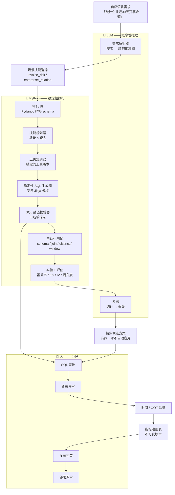
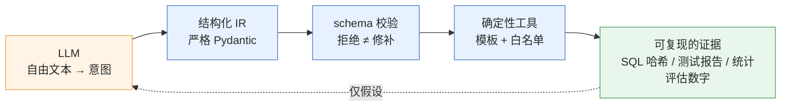
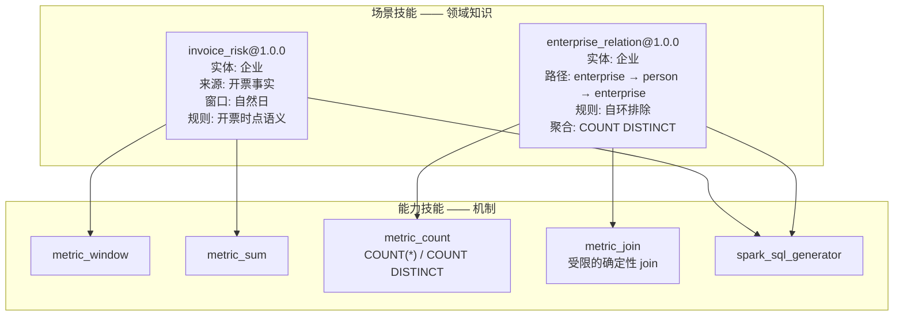
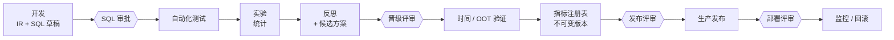

# AIRI 架构总览

> **LLMs reason. Python verifies. Humans govern.**（模型负责推理，Python 负责验证，人负责治理。）

AIRI 把自然语言描述的风控需求变成受治理的指标。下面这条流水线对每个场景都一样——新增一个
业务领域，增加的是知识，而不是一条新工作流。

---

## 1. 端到端流水线

### 角色划分

| 层 | 负责 | 永不负责 |
| --- | --- | --- |
| **LLM** | 需求理解、假设生成、叙事性反思 | 最终 SQL、阈值、晋级决定 |
| **Python** | IR 校验、SQL 生成、静态校验、测试、统计、哈希 | 业务含义、意图 |
| **Human** | 审批、晋级、发布、部署 | 把人工改 SQL 当作主路径 |

LLM 的输出永远是*必须被严格 schema 接受的结构化数据*。如果模型产出了 schema 拒绝的东西，
运行就显式失败——AIRI 从不静默修补，也不回退到一次 mock 的成功。

---

## 2. 概率性推理 + 确定性执行

核心主张是：语言模型可以在不被托付不可逆动作的前提下发挥作用。这一点由一道很窄的接口来
强制：LLM 产出的一切都要被校验，而所有触碰 SQL 的东西都由 Python 生成。

事实由 Python 计算。假设由 LLM 提出。两者分开存储，永不混同。

---

## 3. 场景技能 × 能力技能

这套架构把**业务语义**与**执行机制**分开。正是这一点让第二个毫不相关的场景成为一个增量改动。

场景声明它需要**哪些能力**。能力声明由**哪个锁定的工具**来实现它。没有任何一方会去解析
"最新版"。

关键在于，`metric_join` 知道如何通过受限的等值 join 组合两个结构化数据源——而对企业、自然人、
风控一无所知。`enterprise → person → enterprise` 这条路径存在于场景技能里。这个切分就是
全部要点。

### 技能放在哪里

场景技能与能力技能是
[`src/airi/skills/`](../../src/airi/skills/) 下的 Python 模块，注册进同一个带版本的
`SkillRegistry`：

| 文件 | 内容 |
| --- | --- |
| `models.py` | `ScenarioSkill`、`CapabilitySkill` schema |
| `registry.py` | 带版本的注册表；引用是锁定的，永不是"最新版" |
| `capabilities.py` | 与场景无关的能力（含 `metric_join`） |
| `invoice.py` | `invoice_risk@1.0.0` |
| `enterprise_relation.py` | `enterprise_relation@1.0.0` |
| `dependencies.py` | 技能依赖图检查 |

---

## 4. 指标 IR —— 夹在中间的契约

`MetricIR`（`schema_version 1.0.0`）是每个阶段都在读写的结构化产物。下游没有任何东西会去
解析散文。

| 字段 | 用途 |
| --- | --- |
| `name`, `description`, `entity_type`, `entity_key` | 标识与粒度 |
| `source` | 基础 `DataSource`（catalog / database / table） |
| `aggregation` | `count`、`count_distinct`、`sum`、`avg`、`min`、`max` |
| `filters`, `dimensions` | 单表谓词与分组 |
| `window` | 显式的基于锚点的自然日窗口（左闭右开） |
| `source_alias`, `aggregation_alias` | 确定性 SQL 别名 |
| `joins` | 受限的 `JoinSpec` 列表（仅 `inner` / `left`） |
| `column_filters` | 跨列比较谓词 |

`joins` 与 `column_filters` 是 Phase 11 作为*可选*字段加入的（默认空）。schema 版本没有变，
也**不需要迁移**，因为 join 就存在已有的 JSON 文档列里。规范化哈希覆盖 `joins`，所以同一个
指标换一条关联路径，哈希就不同。

---

## 5. 治理链

一个指标不会因为实验通过就变得可用于生产。每一次状态转换都是一个单独的、由人评审的步骤，
而产物一旦被批准就不可变。

产物是内容寻址的：一份已批准产物的 IR、SQL 和哈希，之后都不能被改写。要改就等于创建一个
新版本。

---

## 6. 运行时安全

生成的 SQL 永远不会被直接交给通用引擎。它要先通过一个带白名单语法的静态校验器
（只允许 `INNER JOIN` / `LEFT JOIN`，禁止 UNION、禁止任意 CTE、禁止 UDF、禁止 DDL/DML、
禁止注释），而执行沙箱会对声明的数据源强制只读访问。

每条边界背后的推理见[设计原则](design-principles.md)，逐阶段的实现记录见
[工程历史](../history/)。
