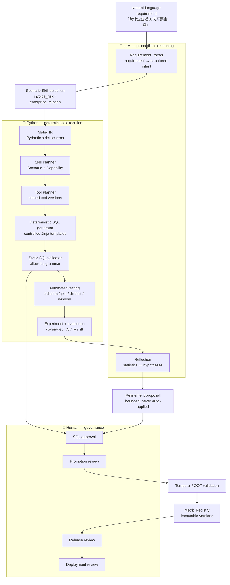
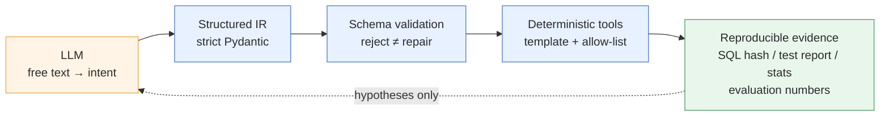
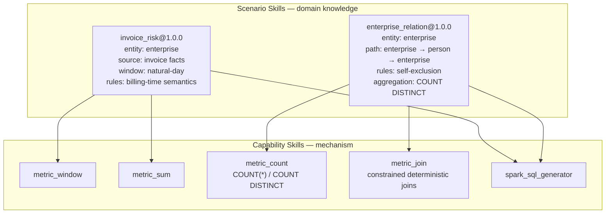

# AIRI Architecture Overview

> **LLMs reason. Python verifies. Humans govern.**

AIRI turns a natural-language risk requirement into a governed metric. The
pipeline below is the same for every scenario — adding a new business domain
adds knowledge, not a new workflow.

---

## 1. End-to-end pipeline

### Role separation

| Layer | Owns | Never owns |
| --- | --- | --- |
| **LLM** | Requirement understanding, hypothesis generation, narrative reflection | Final SQL, thresholds, promotion decisions |
| **Python** | IR validation, SQL generation, static validation, testing, statistics, hashing | Business meaning, intent |
| **Human** | Approval, promotion, release, deployment | Manual SQL editing as the primary path |

The LLM's output is always *structured data that a strict schema must accept*.
If a model emits something the schema rejects, the run fails loudly — AIRI never
silently repairs or falls back to a mock success.

---

## 2. Probabilistic reasoning + deterministic execution

The core claim is that a language model can be useful without being trusted with
irreversible actions. That is enforced by a narrow interface: everything the LLM
produces is validated, and everything that touches SQL is generated by Python.

Facts are computed by Python. Hypotheses are proposed by the LLM. The two are
stored separately and never conflated.

---

## 3. Scenario Skill × Capability Skill

The architecture separates **business semantics** from **execution mechanics**.
This is what makes a second, unrelated scenario an additive change.

A scenario declares **which capabilities** it needs. A capability declares
**which pinned tool** implements it. No one resolves "latest".

Critically, `metric_join` knows how to compose two structured sources through
constrained equality joins — and nothing about enterprises, persons, or risk.
The `enterprise → person → enterprise` path lives in the scenario skill. That
split is the whole point.

### Where skills live

Scenario and capability skills are Python modules under
[`src/airi/skills/`](../../src/airi/skills/), registered into a single
versioned `SkillRegistry`:

| File | Contents |
| --- | --- |
| `models.py` | `ScenarioSkill`, `CapabilitySkill` schemas |
| `registry.py` | versioned registry; references are pinned, never "latest" |
| `capabilities.py` | scenario-independent capabilities (incl. `metric_join`) |
| `invoice.py` | `invoice_risk@1.0.0` |
| `enterprise_relation.py` | `enterprise_relation@1.0.0` |
| `dependencies.py` | skill dependency graph checks |

---

## 4. Metric IR — the contract in the middle

`MetricIR` (`schema_version 1.0.0`) is the structured artefact every stage reads
and writes. Nothing downstream parses prose.

| Field | Purpose |
| --- | --- |
| `name`, `description`, `entity_type`, `entity_key` | identity and grain |
| `source` | base `DataSource` (catalog / database / table) |
| `aggregation` | `count`, `count_distinct`, `sum`, `avg`, `min`, `max` |
| `filters`, `dimensions` | single-table predicates and grouping |
| `window` | explicit anchor-based natural-day window (left-closed, right-open) |
| `source_alias`, `aggregation_alias` | deterministic SQL aliasing |
| `joins` | constrained `JoinSpec` list (`inner` / `left` only) |
| `column_filters` | cross-column comparison predicates |

`joins` and `column_filters` were added in Phase 11 as *optional* fields
(default empty). The schema version did not change and **no migration was
needed**, because joins live inside the existing JSON document column. The
canonical hash covers `joins`, so the same metric with a different relationship
path hashes differently.

---

## 5. Governance chain

A metric does not become production-usable because an experiment passed.
Each transition is a separate, human-reviewed step, and artefacts are immutable
once approved.

```mermaid
flowchart LR
    DEV["Development<br/>IR + SQL draft"] --> A1{{"SQL approval"}}
    A1 --> TEST["Automated testing"]
    TEST --> EXP["Experiment<br/>statistics"]
    EXP --> REF["Reflection<br/>+ proposals"]
    REF --> A2{{"Promotion review"}}
    A2 --> TMP["Temporal / OOT validation"]
    TMP --> REG["Metric Registry<br/>immutable version"]
    REG --> A3{{"Release review"}}
    A3 --> PRD["Production release"]
    PRD --> A4{{"Deployment review"}}
    A4 --> MON["Monitoring / rollback"]
```

Artefacts are content-addressed: an approved artefact's IR, SQL, and hash cannot
be mutated afterwards. Editing means creating a new version.

---

## 6. Runtime safety

Generated SQL is never handed to a general-purpose engine directly. It passes a
static validator with an allow-list grammar (`INNER JOIN` / `LEFT JOIN` only, no
UNION, no arbitrary CTE, no UDF, no DDL/DML, no comments), and the execution
sandbox enforces read-only access against declared sources.

See [Design Principles](design-principles.md) for the reasoning behind each
boundary, and the [Engineering History](../history/) for the phase-by-phase
implementation record.
